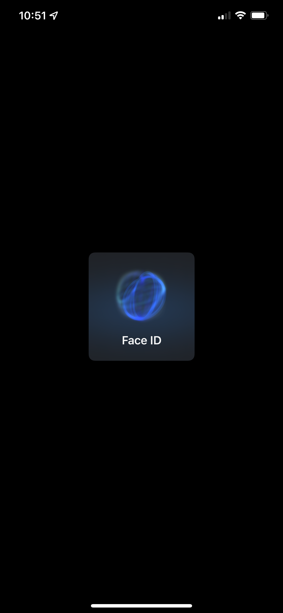
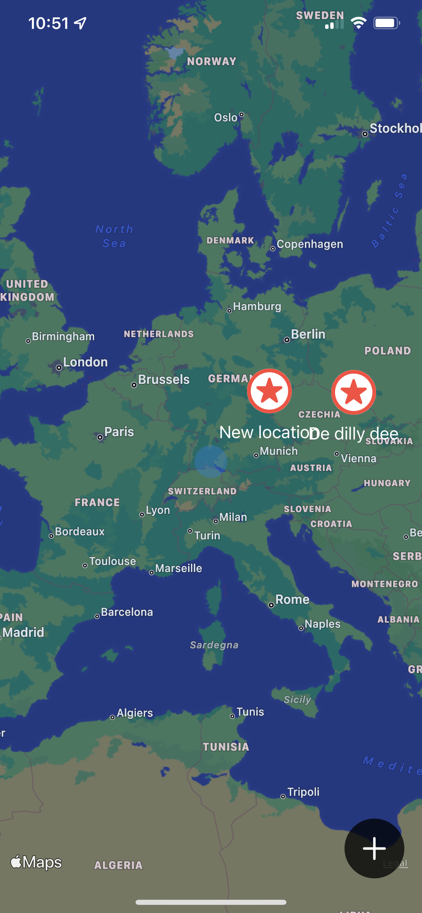
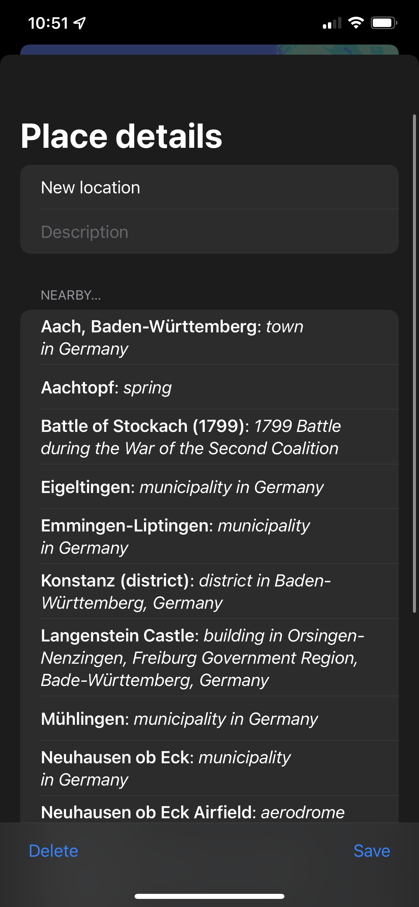

# BucketList
App for marking locations with maps and faceID. Project 14 days 68-73 of 100 days of swiftUI.

This project focused on using mapkit, biometric authentication, and secure data writing. It is a simple app, but those systems require a good bit of code to get functioning in swiftui.
It also includes looking up and pulling data on nearby locations from wikipedia, parsing and showing that information.

   

The interface is very clunky and this is nothing that I would ship, but the functionality of each part works like a charm. 

If you are looking for help with the challenges, please feel free to read through the code, the challenge solutions are all commented in the code files.
